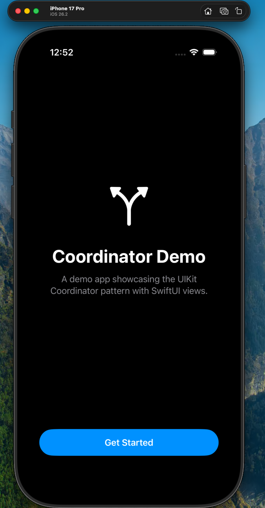
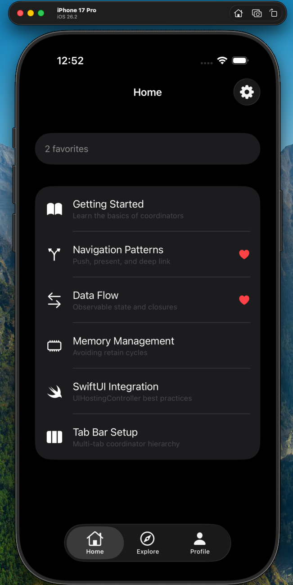
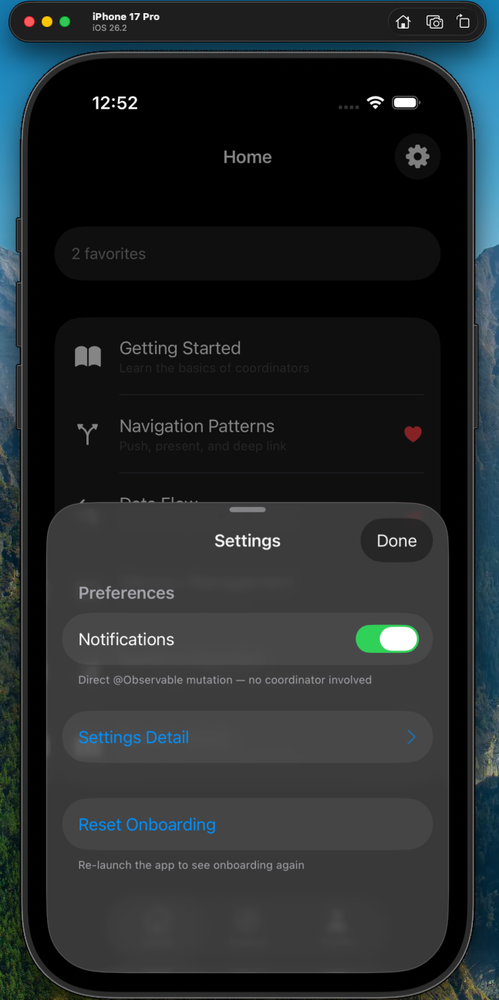
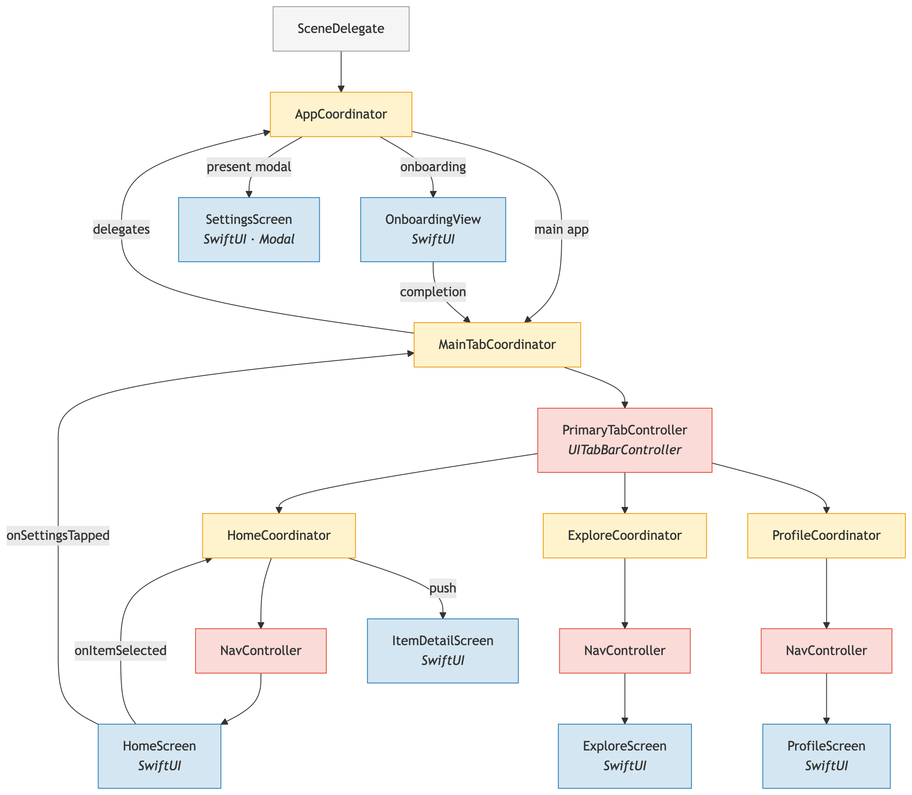

# iOS-Coordinator-Architecture
Companion repo for a blog post showcasing the Coordinator architecture implemented via UIKit + SwiftUI

Full tutorial walking you through how this architecture works:
https://gavinshrader.com/blog/ios-coordinator-architecture/

### App Screenshots

Some quick screenshots of what this app looks like compiled on a device.

  

### Architecture Diagram

Comprehensive breakdown of the full coordinator data flow.

### Disclosure

I used Claude Code (Opus 4.6) to read my full tutorial article and create this Xcode project. The code is simple and self contained and I went through and validated that everything is correct.

---

## License

MIT License — free to use, modify, and distribute for any purpose, including commercial. No attribution required. See [LICENSE](LICENSE) for full terms.
